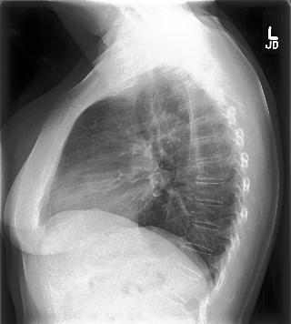
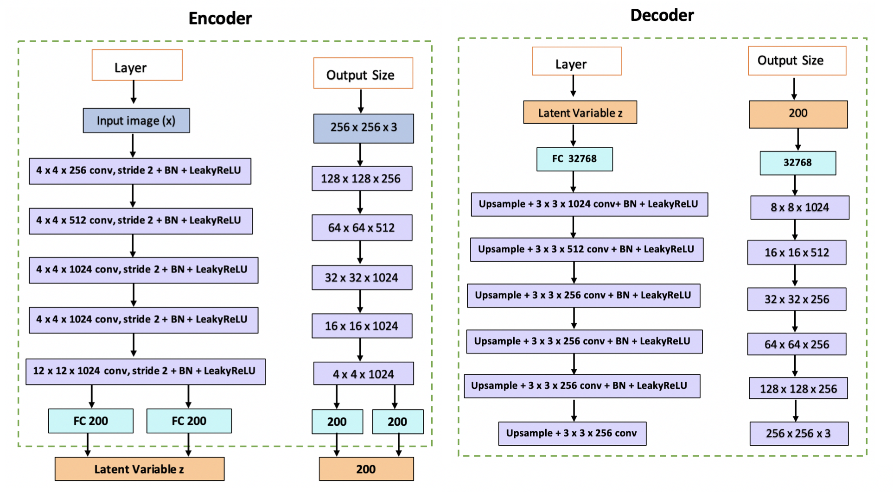

# Introduction

Cancer is the second leading cause of death globally and was responsible for an estimated 9.6 million deaths in 2018. Lung cancer is the leading cause of cancer death in the United States with an estimated 160,000 deaths in the past year[[1]](#ref1). Early detection of cancer, therefore, plays a key role in its treatment, in turn improving long-term survival rates.

There are several barriers to the early detection of cancer, such as a global shortage of radiologists. In addition to the shortage, detecting malignant tumors in X-rays can be difficult and challenging even for experienced radiologists. This time-consuming process typically leads to fatigue-based diagnostic errors and discrepancies[[2]](#ref2).

Our project focuses on detecting the presence of malignant tumors in chest X-rays. In order to aid radiologists around the world, we propose to exploit supervised and unsupervised Machine Learning algorithms for lung cancer detection. We aim to showcase ‘explainable’ models [[3]](#ref3) that could perform close to human accuracy levels for cancer-detection. We envision our models being used to assist radiologists and scaling cancer detection to overcome the lack of diagnostic bandwidth in this domain. We can also potentially export our models to personal devices, which would allow for easier, cheaper and more accessible cancer detection. 

__________

# Dataset

We used the CheXpert Chest radiograph datase[[4]](#ref4) to build our initial dataset of images. To build our dataset, we sampled data corresponding to the presence of a ‘lung lesion’ which was a label derived from either the presence of “nodule” or “mass” (the two specific indicators of lung cancer). 

The initial (unaugmented) dataset:

#### Train:
Benign images (Negative class): 6488 images  
Malignant (Positive class): 6287 images

#### Validation:
Benign images (Negative class): 1500 images  
Malignant (Positive class): 1450 images

#### Test:
Benign (Negative class): 1500 images  
Malignant (Positive class): 1449 images

In the training phase, we treated all images with transformations to augment our data by performing random resized crop and lateral inversions with a 50% probability. 

In addition to the above all images were normalized using the channel-wise mean and standard deviation values computed on the ImageNet dataset. 
____

# Supervised Learning

## Approach: 
We use a transfer learning approach to perform supervised binary classification of images as 'benign' or 'malignant' based on the presence of malignant tumors. 

## Reason behind adopting this approach:

It is known that tumors are of different shapes and sizes and can occur at different locations, which makes their detection challenging[[5]](#ref5). In addition to this, deep learning approaches have been showing expert-level performance in medical image interpretation tasks in the recent past (for eg., Diabetic Retinopathy[[6]](#ref6)). This can be attributed to both - availability of large labeled data sets and the ability of deep neural networks to extract complex features from within the image. 

It would be tedious (and maybe near impossible) to hand-design the features that one would need to build models for this task. This, in combination with the fact that we were dealing with a dataset containing a significantly smaller amount of images directly points to using a transfer learning approach where we initialize the parameters from a network pre-trained on ImageNet data and modify the final fully connected layer of the pre-trained network to a new fully-connected layer producing 2 responses indicative of the predicted probabilities of the two classes.

## What’s new in our approach:

1. The overall architecture of feature_extraction + grad_cam visualization + data augmentation via VAEs is new and has not been approached on a medical image dataset to the best of our knowledge.
2. If our approach can show improved results, it could mean that we do not necessarily have to collect a large amount of data at all times and would be able to manage with smaller datasets. 

### Proposed System Architecture

Fig 1. System Architecture: The classifier is trained on the training dataset and the generated data from the Variational AutoEncoders. The model classifies a test X-ray as benign or malignant and highlights the region that contributes most to the classification. 

_____

# Grad CAM

Among the most important areas of research in deep learning today is that of interpretability, i.e, being able to demystify the black-box nature (owing to its non-convex nature) of a neural network and identify the key reasons for making its predictions. Various approaches have been proposed to help with this exercise, the most recent of which involves gradient-based class activation mappings that highlight the specific pixels (or regions) of an image that most strongly activate a certain class of the model’s prediction. Abbreviated as Grad-CAM, this approach has become a universally accepted yardstick for interpretability in the deep learning research community across a wide range of tasks such as image classification, object detection, image captioning and visual question answering. 

This becomes a particularly relevant addition to a medical diagnostic tool considering the serious implications of algorithmic decision making in this domain. It is essential to build trust in the algorithms among doctors and patients alike. Critically, it also sheds light on the imperfections of a trained model when it makes incorrect predictions or when it makes the right predictions for the wrong reasons. While somewhat intellectually dissatisfying, it shouldn’t surprise us that these cases are plenty in number because the training paradigm in deep learning problems simply maps input data to output labels, with no scope for detailed reasoning on the causal relationships behind this mapping. These heatmaps generated from Grad-CAM are an important step in the direction of making our model’s predictions more trustworthy, and in this domain, would aid a radiologist in examining potentially relevant areas in the X-ray images that are likely to be of diagnostic importance.

We demonstrate a few applications of Grad-CAM to our problem and showcase its usefulness (and occasional unreliability) in the following examples.

 

Fig 2. An example of the working mechanism of Grad-CAM. This is an image classification task where a deep neural network has predicted the left image to correspond to the ‘elephant’ class, while the right image highlights the precise region of the image that most strongly activated the ‘elephant’ class.

Fig 3. On the left is the original lateral chest X-ray image that has been correctly classified as malignant. On the right is the Grad-CAM heatmap that points to the precise region in the X-ray where there’s a clumping of cells that explains the prediction of malignancy. 

Fig 4. On the left is the original lateral chest X-ray image that has been correctly classified as malignant. On the right is the Grad-CAM heatmap that points to the precise region in the X-ray where a radiologist ought to be looking at for cues on potential malignancy.

Fig 5. Grad-CAM is also useful to remind ourselves that when deep neural networks get predictions right, they don’t always do so for the correct underlying reasons. Here on the left is the original frontal chest X-ray that has been correctly classified as malignant. On the right is the Grad-CAM heatmap that points to seemingly irrelevant regions in the X-ray that are unrelated to potential malignancy.

Fig 6. This example points to yet another fallibility of deep neural networks that Grad-CAM brings to light. While the original frontal chest X-ray on the left has been correctly classified as malignant, we see in the heatmap on the right that there are multiple regions of interest, one of which may be the appropriate region of malignancy. Domain experts could use these maps as cues for further manual investigation.

________

# Unsupervised Learning

In the clinical setting, it becomes extremely important to train a model that can handle the entire range of variations in the patient’s X-ray scan. However, it  becomes nearly impossible to obtain all possible variations of input. In addition to this, one of the biggest challenges in the medical field is the lack of sufficient image data, which are laborious and costly to obtain. With data privacy being especially important in the medical domain, it is difficult to obtain the sufficient amount of data that is required for building robust models. Therefore, data augmentation emerges as an essential technique that could be leveraged to increase the variability of the dataset, thus reducing the risk of overfitting. Conventional transformation methods (eg: flip, rotation) can be used to augment our training corpus, but their outputs are highly dependent on the original data. Hence, we propose to make use of an unsupervised technique of generating new samples having similar properties as that of the training dataset. 

A Variational Autoencoder (VAE) is one such deep generative model that estimates the probability density function of the dataset. VAE is an architecture which comprises of an encoder and a decoder, and is trained to minimise the reconstruction error between the encoded-decoded data and the initial data. The encoder projects each input datapoint onto a latent space that follows a normal distribution. Thus it converts the input into a d-dimensional latent vector that can be sampled with mean  and standard deviation  through reparametrization. The decoder then decodes these latent representations and reconstructs the input data. The loss function of the variational autoencoder is the sum of the reconstruction loss and the regularizer.

Eq 1. Loss function of a Variational Autoencoder

The first term is the reconstruction loss, or the expected negative log-likelihood of the i-th datapoint. The expectation is taken with respect to the encoder’s distribution over the representations. This term encourages the decoder to learn to reconstruct the data. The second term is a regularizer which in our case is the Kullback-Leibler divergence between the encoder’s distribution and the standard Gaussian distribution.

We designed a deep VAE having the architecture described in Figure 5 and sampled a thousand images for each category ( benign and malignant ). These sampled images were added to the training dataset and our supervised models were re-tested on the newly augmented training corpus.

Fig 3. Architecture of CNN based Variational AutoEncoder.

  

Fig 3. Images sampled from VAE.The top two images belong to the benign class while the bottom two are from the malignant class of X-ray scans

# Evaluation

### Supervised Learning
 | Metrics | Initial | Augmented | Initial | Augmented |
 |---------|---------|-----------|---------|-----------|
 | Accuracy | 68.83 | 71.48 | 70.53 | 73.11  |
 | Precision | 65.30 | 69.31 | 70.50 | 70.12 |
 | Recall | 78.05 | 75.29 | 68.80 | 78.89 |
 | Summary | 71.10 | 72.18 | 69.65 | 74.24 |
 

Table 1: Summary of results obtained in the supervised binary classification task using two different network architectures. Initial refers to the results obtained by training the network on the initial dataset and augmented refers to the results obtained by training the network on the augmented dataset. The results show a marked improvement in accuracy and recall post augmentation on both network architectures without a significant reduction in precision.

### Unsupervised Learning

There are no evaluation methods for VAE since there are no good quantitative metrics that relies on visual inspection. It is still an open research topic. Hence we will rely on the results from supervised learning after data augmentation.

# Results

Chart 1: Left: The validation accuracy of AlexNet over different epochs for models trained with base data and augmented data. Right: The test accuracy of AlexNet over different epochs for models trained with base data and augmented data. The model trained with the augmented data outperforms the model trained with the base data.

Chart 2: Left: Confusion Matrix of the network trained over base data. Right:Confusion matrix of the network trained with augmented data. The model trained with the augmented data outperforms the model trained with the base data.

### Average Metrics for both networks: AlexNet and DenseNet

_____________

# Conclusion

In this project, we developed a machine learning solution to address the requirement of clinical diagnostic support in oncology by building supervised and unsupervised algorithms for cancer detection. From a supervised learning perspective, we demonstrated the effectiveness of transfer learning by using pre-trained convolutional classifiers and fine-tuning them to achieve reasonably good results in our complex domain. We showcased ‘explainable’ models that could reason about their predictions and reduce ambiguity. We also presented a way to overcome inherent data accessibility limitations in the medical field and avoid overfitting by implementing a data augmentation technique using variational autoencoders, resulting in a clear increase in accuracy, thus tightly entangling the supervised and unsupervised components of our solution. We view this as a comprehensive solution that tackles the multiple challenges of data limitations, interpretability and accuracy that are integral to algorithmic successes in the medical domain, and foresee strong potential for its widespread deployment in production, especially on embedded devices equipped with cameras that could provide instant assistance to radiologists around the world.

_______

# References

 1. Rajpurkar, P., Irvin, J., Zhu, K., Yang, B., Mehta, H., Duan, T. et.al., M. P. (2017). Chexnet: Radiologist-level pneumonia detection on chest x-rays with deep learning.  
 2. Yongsik Sim,  Myung Jin Chung et al. Deep Convolutional Neural Network–based Software Improves Radiologist Detection of Malignant Lung Nodules on Chest Radiographs, Radiology, 2019.  
 3. R. R. Selvaraju, M. Cogswell, A. Das, R. Vedantam, D. Parikh and D. Batra, "Grad-CAM: Visual Explanations from Deep Networks via Gradient-Based Localization," 2017 IEEE International Conference on Computer Vision (ICCV), Venice, 2017, pp. 618-626.  
 4. Kingma P, Welling M., An Introduction to Variational Autoencoders, arXiv:1906.02691.  
 5. Ardila, D., Kiraly, A.P., Bharadwaj, S. et al. End-to-end lung cancer screening with three-dimensional deep learning on low-dose chest computed tomography. Nat Med 25, 954–961 (2019).  
 6. Gulshan V, Peng L, Coram M, et al. Development and Validation of a Deep Learning Algorithm for Detection of Diabetic Retinopathy in Retinal Fundus Photographs. JAMA. 2016.  
 7. Irvin, Jeremy & Rajpurkar, Pranav & Ko, Michael & Yu, Yifan & Ciurea-Ilcus, Silviana & Chute, Chris & Marklund, Henrik & Haghgoo, Behzad & Ball, Robyn & Shpanskaya, Katie & Seekins, Jayne & Mong, David & Halabi, Safwan & Sandberg, Jesse & Jones, Ricky & Larson, David & Langlotz, Curtis & Patel, Bhavik & Lungren, Matthew & Ng, Andrew. (2019). CheXpert: A Large Chest Radiograph Dataset with Uncertainty Labels and Expert Comparison. 
 8. Xianxu Hou, Linlin Shen, Ke Sun, and Guoping Qiu. Deep feature consistent variational autoencoder. In Applications of Computer Vision (WACV), 2017 IEEE Winter Conference on, pp. 1133–1141. IEEE, 2017.
 9. Javier Jorge, Jesús Vieco, Roberto Paredes, Joan-Andreu Sánchez, and José-Miguel Benedí. Empirical evalua- tion of variational autoencoders for data augmentation.

